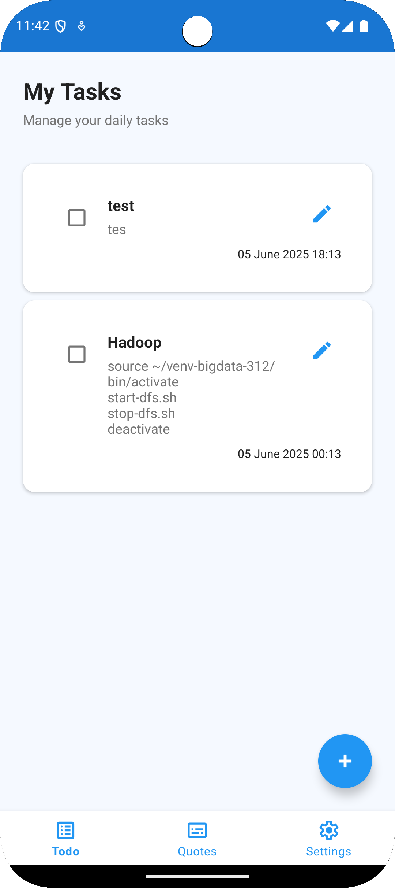
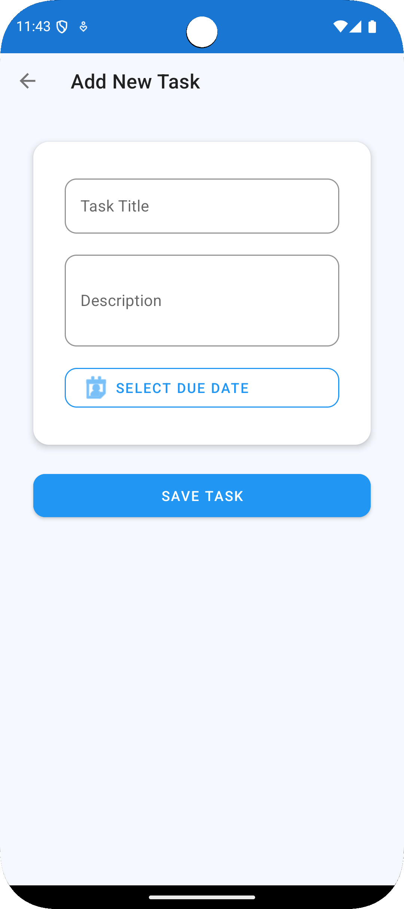
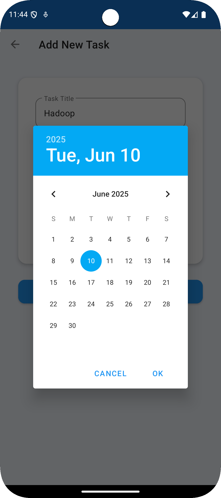
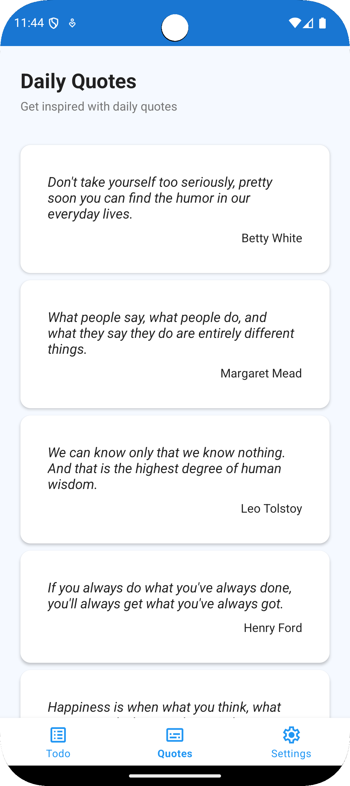
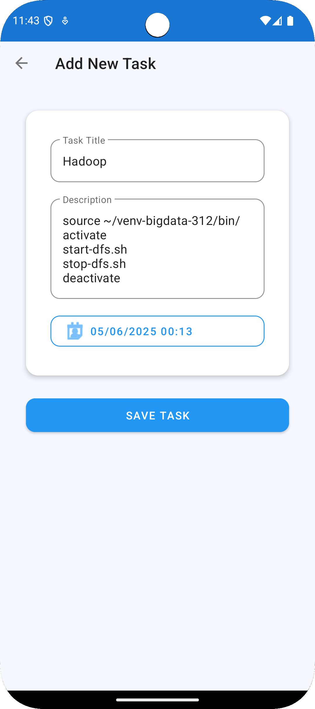
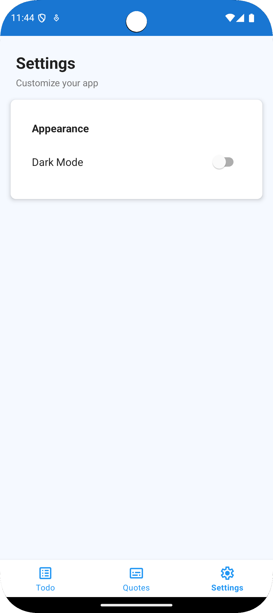

# Mobile_Project_2025 - Aplikasi To-Do List Android

   ## Ringkasan Project

**Mobile_Project_2025** adalah sebuah aplikasi Android bertema produktivitas yang berfungsi sebagai to-do list digital. Aplikasi ini memungkinkan pengguna untuk mencatat, memodifikasi, menandai, dan menghapus tugas harian mereka. Dengan antarmuka yang sederhana namun fungsional, pengguna dapat fokus menyelesaikan pekerjaan secara efisien.

Aplikasi ini dikembangkan sebagai bagian dari tugas akhir mata kuliah **Pemrograman Mobile 2025**, dengan tujuan mengeksplorasi penggunaan komponen Android seperti `Activity`, `Fragment`, `RecyclerView`, dan `Room Database` menggunakan bahasa Java.

---

## Tujuan Aplikasi

- Membantu pengguna mengelola dan mengingat tugas-tugas penting secara terorganisir.
- Meningkatkan produktivitas harian dengan mencatat target atau deadline.
- Menyediakan pengalaman pengguna yang ringan dan intuitif dalam penggunaan harian.

---

## Teknologi yang Digunakan

| Komponen           | Keterangan                                                                 |
|--------------------|----------------------------------------------------------------------------|
| **Java**           | Bahasa utama dalam pengembangan aplikasi.                                  |
| **Android SDK**    | Digunakan untuk mengakses fitur native Android.                            |
| **Room Database**  | Untuk menyimpan data tugas secara lokal.                                   |
| **RecyclerView**   | Untuk menampilkan daftar tugas secara dinamis dan efisien.                 |
| **LiveData + ViewModel** | Untuk pemisahan logika dan lifecycle-aware UI updates.            |
| **Fragment**       | Memecah tampilan menjadi komponen modular yang dapat dipakai ulang.        |
| **Retrofit (opsional)** | Jika aplikasi menggunakan API, Retrofit digunakan untuk fetch data. |

---

## Struktur Proyek
```plaintext
Mobile_Project_2025/
├── app/
│   ├── src/main/
│   │   ├── java/com/project/todolist/
│   │   │   ├── activity/        
│   │   │   ├── fragment/        
│   │   │   ├── adapter/        
│   │   │   ├── model/            
│   │   │   └── database/         
│   │   ├── res/
│   │   │   ├── layout/           
│   │   │   ├── drawable/        
│   │   │   └── values/          
│   │   └── AndroidManifest.xml
├── build.gradle                
├── settings.gradle            
└── README.md                 
```
---

## Fitur-Fitur Aplikasi

Berikut adalah fitur utama dari aplikasi ini:

### Tambah Tugas
Pengguna dapat menambahkan tugas baru melalui form input. Setiap tugas dapat memiliki nama, deskripsi, dan status.

### Edit Tugas
Tugas yang telah dibuat dapat diedit untuk memperbarui informasi.

### Tandai Tugas Selesai
Pengguna dapat menandai tugas sebagai telah selesai. Tugas selesai ditandai dengan gaya visual berbeda (misalnya garis coret atau warna abu-abu).

### Hapus Tugas
Tugas dapat dihapus dari daftar secara permanen.

### Penyimpanan Lokal (Offline)
Data disimpan secara lokal menggunakan Room Database, sehingga tetap tersedia meskipun tanpa koneksi internet.

### Tampilan Dinamis
Menggunakan LiveData dan ViewModel, semua perubahan data langsung ditampilkan di UI secara otomatis.

---
## Tampilan Aplikasi
### Home
  
### Add Task

### Add Date

### Daily Quotes

### Edit Task

### Setting

---

## Instalasi & Menjalankan Proyek

Ikuti langkah-langkah berikut untuk menjalankan proyek ini di Android Studio:

1. **Clone Repositori**
   ```bash
   git clone https://github.com/Chndrajunardi/Mobile_Project_2025.git
   cd Mobile_Project_2025

